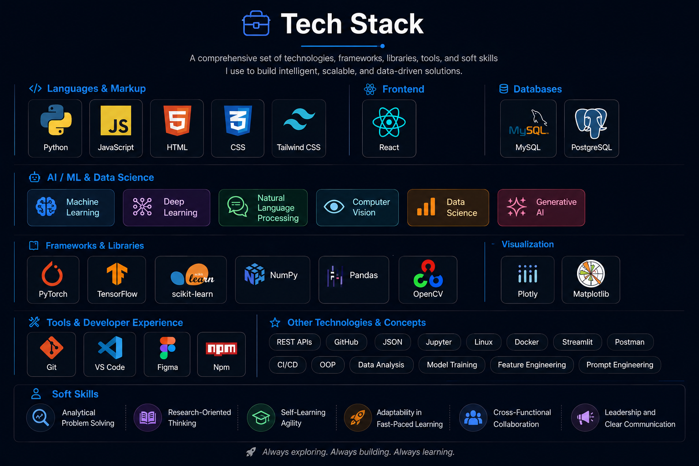

  

  

## 🚀 About Me

- 🤖 **Focus Area:** Specializing in Web Development, Data Engineering, Machine Learning.
- 💡 **Passion:** Building production-grade Web Pages, Full Stack Projects.
- ⚡ **Fun Fact:** Building the future at the intersection of bits, pipelines, and brains. 🌐 Web Dev displays it, ⚙️ Data Engineering scales it, and 🧠 Machine Learning makes it smart..

## 🛠️ Tech Arsenal

  

 

## 📊 My Contributions

  <picture>
    <source media="(prefers-color-scheme: dark)" srcset="https://raw.githubusercontent.com/aaditya-nahar-jain/aaditya-nahar-jain/output/github-contribution-grid-snake-dark.svg" />
    <source media="(prefers-color-scheme: light)" srcset="https://raw.githubusercontent.com/aaditya-nahar-jain/aaditya-nahar-jain/output/github-contribution-grid-snake-dark.svg" />
    
  </picture>

### ✍️ Random Dev Quote

